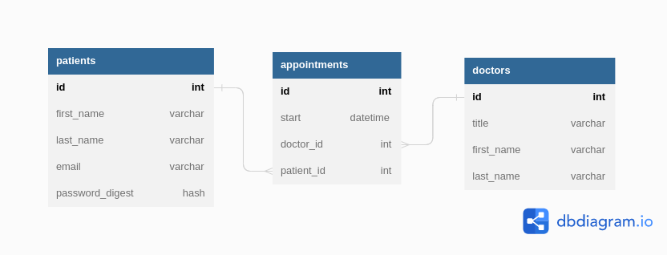

# **Appointment Scheduling Application**

## **_Description_**

This scheduling application enables a user to create an account with which they can schedule and modify appointments. The application utilizes React for the front end and Ruby on Rails for the backend.

The server accepts the following HTTP requests:
| **Path** | **Request Type** | **Action** |
|------------|------------------|---------------------------------------------------------------------------------|
| /me | GET | If the user ID contained in the session info exists in database, return authorized status. |
| /appointments | GET | Retrieve all appointments for the session user. |
| /appointments | POST | Create a new appointment |
| /appointments/:id | DELETE | Delete appointment matching ID parameter. |
| /appointments/:id | PATCH | Update appointment details for appointment matching ID parameter. |
| /blocked | GET | Retrieve all booked appointments at the office. Returned data includes start date and time as well as doctor ID. |
| /doctors | GET | Retrieve an object containing all doctors at the office. |
| /signup | POST | Send new user data to server for processing. |
| /login | POST | Send user data (email and encrypted password) to server for processing. |
| /logout | DELETE | Delete current user session. |

### _Entity-Relationship_

The Entity-Relationship Diagram below displays the relationships between the three tables contained within the database. The appointments table is the join table, joining patients and doctors. The appointments table contains two foreign ID's. One points to the ID of the associated patient (**_patient_id_**) and the other points to ID of the associated doctor (**_doctor_id_**). The diagram also shows that an appointment can only have _one_ patient and _one_ doctor. However, both patients and doctors may have _many_ appointments.



---

## **_Install_**

### _Clone the repository_

```bash
git clone https://github.com/NicMortelliti/appointment-scheduler.git
cd appointment-scheduler
```

## Backend Setup

### _Check your Ruby version_

```properties
ruby -v
```

The output should start with something like `ruby 2.7`.

If not, install the right ruby version using [rvm](https://rvm.io/). If using a linux-based system, I highly recommend following the [installation guide](https://wiki.archlinux.org/title/RVM) from the arch wiki instead:

```properties
rvm install 2.7
```

### _Check your Rails version_

```properties
rails -v
```

The output should start with something like `Rails 6.1`

If not, install the right Rails version using the gem installer that comes with Ruby.

```properties
gem install rails -v 6.1.7
```

### _Install dependencies_

Using [Bundler](https://bundler.io/):

```properties
bundle install
```

### _Initialize the database_

```properties
rails db:create db:migrate db:seed
```

## Frontend Setup

Use the package manager [npm](https://www.npmjs.com/) to install the dependencies.

```properties
npm install --prefix client
```

---

## **_Run_**

### _Start the back end server_

```properties
rails s
```

### _Start the front end server_

Open a new console tab or window, then type:

```properties
npm start --prefix client
```

The Rails server should now be running on `localhost:3000` and the client server should be running on `localhost:4000`.

---

## **_Usage_**

### _Setting up a new user account_

1. Navigate to [http://localhost:4000](http:localhost:4000).

2. Click `sign up` at the bottom of the login form.

3. Enter new user credentials in the sign up form.

4. Click the `Submit` button.

### _Log in as exising user_

1. Navigate to [http://localhost:4000](http:localhost:4000).

2. Enter your credentials in the log in form.

3. Click the `Log In` button.

### _Schedule an appointment_

_The following instructions assumes the user is logged in._

1. Click `New Appointment` in the navigation bar at the top of the page.

2. Select a doctor from the drop-down menu.

3. Select an available appointment from the time slot chart.

4. Click the `Submit` button to schedule the appointment, or `Discard Changes` to exit without scheduling an appointment.

### _Modifying an existing appointment_

_The following instructions assumes the user is logged in._

1. Click the `Reschedule` button on the card of the appointment you wish to reschedule.

2. Make modifications to the appointment.

3. Click the `Submit` button to reschedule your appointment, or `Discard Changes` to exit the reschedule page without making changes to your appointment.

### _Cancel appointment_

_The following instructions assumes the user is logged in._

1. Click the `Cancel` button on the card of the appointment you wish to reschedule.

2. Confirm you would like to cancel the appointment by clicking the `Yes` button, or click the `No` button to exit without making changes to the appointment.

---

## **_License_**

[MIT](https://choosealicense.com/licenses/mit/)
